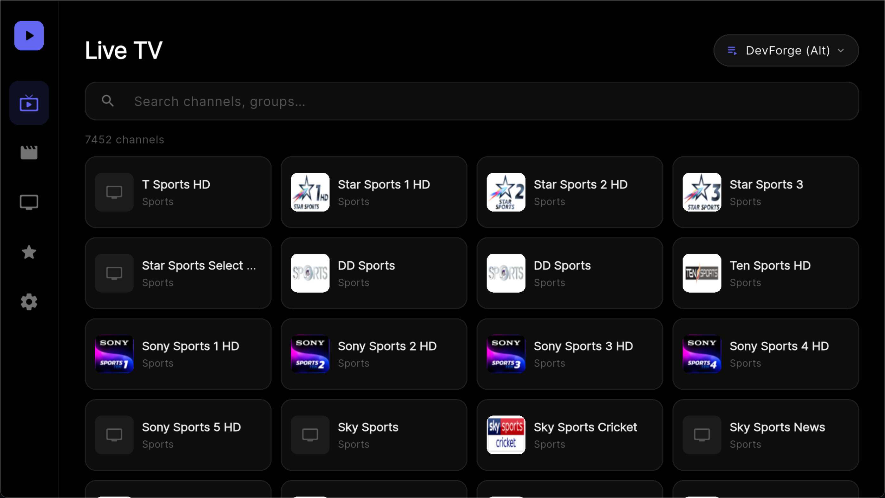

# Joy TV

[](https://flutter.dev)
[](https://dart.dev)
[](https://opensource.org/licenses/MIT)

Joy TV is an open-source Flutter IPTV app built for both Android TV and mobile. It combines large live TV playlists, fast remote-friendly navigation, and a fullscreen playback experience with playlist parsing, caching, and automated source generation.



## Highlights

- Live TV playback with `better_player_plus`
- Android TV and D-pad friendly navigation
- Mobile and TV layouts in one codebase
- Combined playlist generation through GitHub Actions
- Support for common IPTV metadata and custom playlist directives
- Local playlist cache and remote source sync
- TMDB-backed movie and series discovery screens

## Playlist Support

Joy TV now handles more real-world IPTV playlist metadata instead of only basic `#EXTINF` entries.

Supported tags currently include:

- `#EXTM3U`
- `#EXTINF`
- `#EXTVLCOPT`
- `#KODIPROP`
- `#EXT-X-APP`
- `#EXT-X-APTV-TYPE`
- `#EXT-X-SUB-URL`

The app parser preserves supported directive lines, runtime headers, Kodi-style properties, and APTV metadata. The playlist generator workflow also preserves and re-emits supported directives into the combined playlist.

## Project Structure

- `lib/screens` UI screens for home, playback, filtering, and discovery
- `lib/widgets` reusable TV and mobile interface components
- `lib/services` playlist parsing, caching, merging, and stream services
- `lib/models` app data models including IPTV channels and sources
- `assets` bundled playlists, source definitions, and images
- `scripts` local tools for playlist fetching and generation
- `.github/workflows` automation for scheduled playlist regeneration

## Getting Started

### Prerequisites

- Flutter stable SDK
- Dart SDK matching the Flutter version
- Android Studio or VS Code
- An Android TV device, emulator, or mobile device for testing

### Installation

```bash
git clone https://github.com/yourusername/joy_tv.git
cd joy_tv
flutter pub get
flutter run
```

## Playlist Generation

Joy TV ships with a source list in [`assets/playlists.json`](/Users/eq/Workspace/rnd/joy_tv/assets/playlists.json) and a generated combined playlist in [`assets/default_playlist.m3u8`](/Users/eq/Workspace/rnd/joy_tv/assets/default_playlist.m3u8).

To regenerate the combined playlist locally:

```bash
python3 scripts/combine_playlists.py
```

You can also use:

```bash
bash scripts/run_combine.sh
```

The GitHub workflow in [`playlist-generator.yml`](/Users/eq/Workspace/rnd/joy_tv/.github/workflows/playlist-generator.yml) runs the same generation process on a schedule and prints a directive summary for the generated output.

## Development Notes

- Parser logic lives in [`m3u_parser.dart`](/Users/eq/Workspace/rnd/joy_tv/lib/services/m3u_parser.dart)
- Parser tests live in [`m3u_parser_test.dart`](/Users/eq/Workspace/rnd/joy_tv/test/m3u_parser_test.dart)
- Playlist generation logic lives in [`combine_playlists.py`](/Users/eq/Workspace/rnd/joy_tv/scripts/combine_playlists.py)

## License

This project is licensed under the MIT License.
